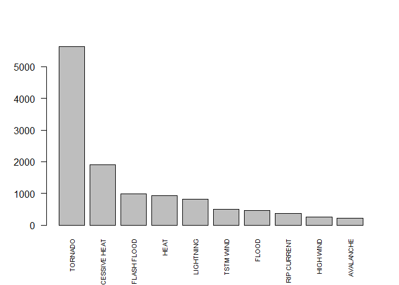

# Analysis of Health and Economic Impacts of Weather Events in the US
## Synopsis


## Data Processing

We start by loading the data 


```r
storm <- read.csv(bzfile("repdata_data_StormData.csv.bz2"))
```


## Analysis


```r
library(dplyr)
by_ev <- group_by(storm, EVTYPE)
test <- summarise(by_ev, sum(FATALITIES))
names(test)[2] <- "SUM_FATAL"
fatal <- test[test$SUM_FATAL != 0, ]
fatal <- fatal[order(fatal$SUM_FATAL, decreasing = TRUE),]

top <- fatal$SUM_FATAL[1:10]
names(top) <- fatal$EVTYPE[1:10]
barplot(top, cex.names = 0.7, las=2)
```

<!-- -->


## Results

This rough analysis shows that *Tornados* are the most harmful weather events in the US in terms of casualties.
However, the first step to getting a more accurate picture would be to clean up the categorization of event types in the dataset (many distinct EVTYPE values for a single actual event type, such as *thunderstorm wind*)
